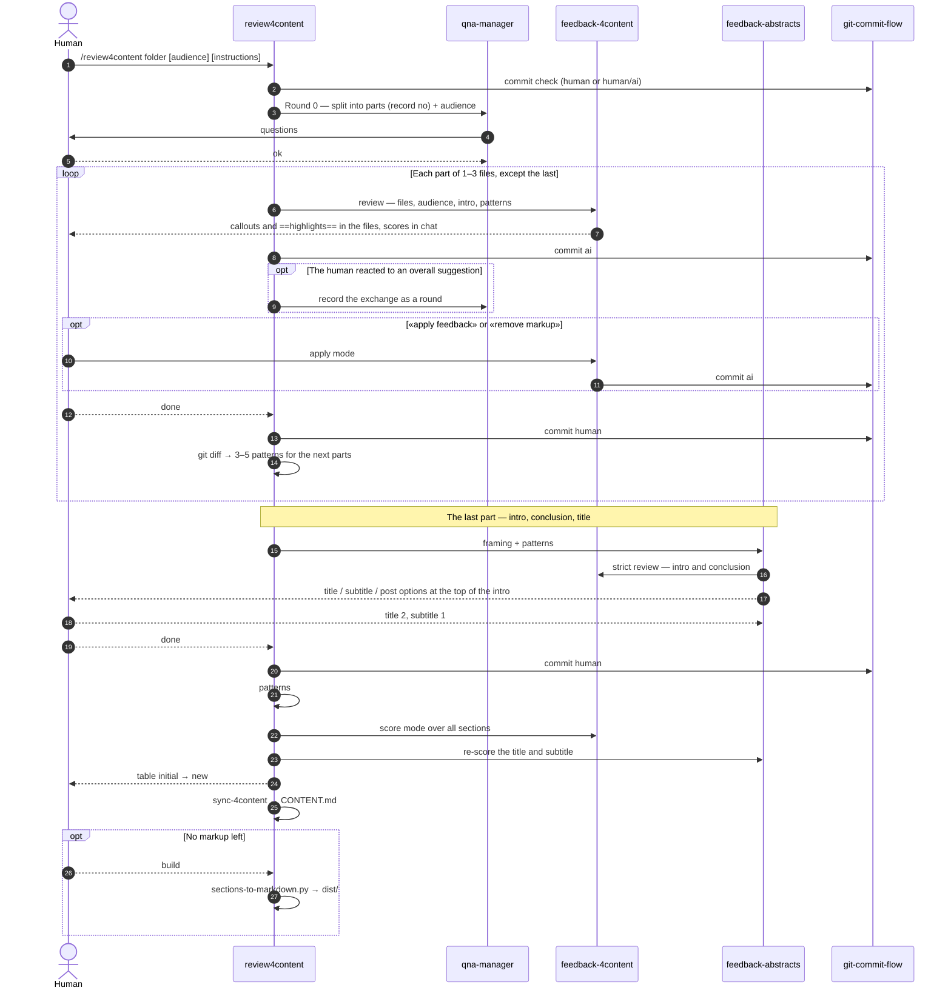

# review4content process

The AI marks up, the human edits, the agent learns from the diff before the next
part. A sequence diagram shows best who waits for whom and when each commit happens.

```mermaid
sequenceDiagram
  autonumber
  actor H as Human
  participant R as review4content
  participant Q as qna-manager
  participant F as feedback-4content
  participant A as feedback-abstracts
  participant G as git-commit-flow

  H->>R: /review4content folder [audience] [instructions]
  R->>G: commit check (human or human/ai)
  R->>Q: Round 0 — split into parts (record no) + audience
  Q->>H: questions
  H-->>Q: ok

  loop Each part of 1–3 files, except the last
    R->>F: review — files, audience, intro, patterns
    F-->>H: callouts and ==highlights== in the files, scores in chat
    R->>G: commit ai
    opt The human reacted to an overall suggestion
      R->>Q: record the exchange as a round
    end
    opt «apply feedback» or «remove markup»
      H->>F: apply mode
      F->>G: commit ai
    end
    H-->>R: done
    R->>G: commit human
    R->>R: git diff → 3–5 patterns for the next parts
  end

  Note over R,A: The last part — intro, conclusion, title
  R->>A: framing + patterns
  A->>F: strict review — intro and conclusion
  A-->>H: title / subtitle / post options at the top of the intro
  H-->>A: title 2, subtitle 1
  H-->>R: done
  R->>G: commit human
  R->>R: patterns

  R->>F: score mode over all sections
  R->>A: re-score the title and subtitle
  R-->>H: table initial → new
  R->>R: sync-4content → CONTENT.md
  opt No markup left
    H-->>R: build
    R->>R: sections-to-markdown.py → dist/
  end
```
